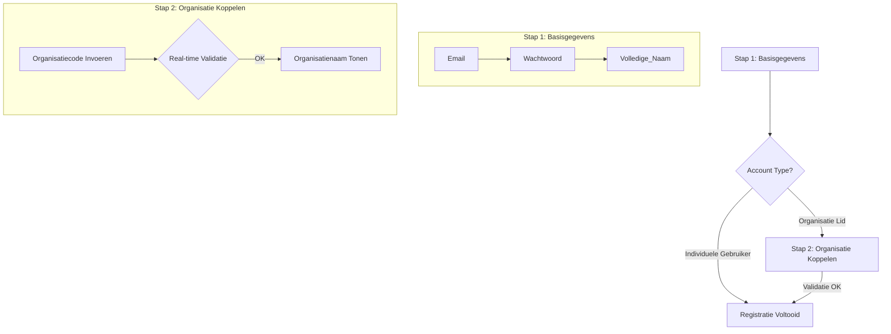

# Implementatieplan: Gebruikersregistratie & Signup

## 🎯 Doel en Aanleiding

### Doel
De implementatie van een volledige gebruikersregistratie-flow voor DoBbie die naadloos integreert met de bestaande Supabase-authenticatie-infrastructuur en het databaseschema. De registratie moet onderscheid maken tussen individuele gebruikers en organisatieleden, met automatische aanmaak van profielen en validatie van organisaties.

### Aanleiding
- **Huidige staat**: De login-functionaliteit is volledig geïmplementeerd met Supabase-authenticatie.
- **Database gereed**: De tabellen `organizations` en `profiles` bestaan, en RLS-policies zijn actief.
- **Ontbrekende schakel**: Gebruikers kunnen zich nog niet zelfstandig registreren via de frontend.
- **Business need**: Organisaties moeten gebruikers de mogelijkheid bieden om zich te registreren met een organisatiecode.
- **MVP requirement**: Een eenvoudige maar veilige registratie-flow zonder complexe workflows.

---

## 📊 Statusoverzicht & Prioritering

| Fase       | Component                      | Status   | Prioriteit | Geschatte Tijd | Dependencies                |
| :--------- | :----------------------------- | :------- | :--------- | :------------- | :-------------------------- |
| **FASE 1** | **Registration UI Components** | ✅ `Done`  | `KRITIEK`  | 2-3 uur        | Styleguide                  |
| 1.1        | Registratiepagina aanmaken     | ✅ `Done`  | -          | 1.5 uur        | Login pagina als template   |
| 1.2        | Multi-step form component      | ✅ `Done`  | -          | 1 uur          | UI componenten bibliotheek  |
| 1.3        | Organization code validationUI| ✅ `Done`  | -          | 30 min         | Supabase client             |
| **FASE 2** | **Registration Logic**         | ✅ `Done`  | `KRITIEK`  | 2 uur          | Database functies           |
| 2.1        | Registration form validation   | ✅ `Done`  | -          | 45 min         | Form validation library     |
| 2.2        | Supabase auth integration      | ✅ `Done`  | -          | 45 min         | `userStore` updates         |
| 2.3        | Error handling & UX feedback   | ✅ `Done`  | -          | 30 min         | UI componenten              |
| **FASE 3** | **Organization Integration**   | ✅ `Done`  | `KRITIEK`  | 1.5 uur        | Database RPC functies       |
| 3.1        | Organization code lookup       | ✅ `Done`  | -          | 45 min         | Supabase RPC call           |
| 3.2        | Account type determination     | ✅ `Done`  | -          | 30 min         | Business logic              |
| 3.3        | Registration metadata handling | ✅ `Done`  | -          | 15 min         | Supabase `user_metadata`    |
| **FASE 4** | **Testing & Polish**           | ✅ `Done` | `KRITIEK`  | 1 uur          | Volledige flow              |
| 4.1        | End-to-end registration test   | ✅ `Done` | -          | 30 min         | Test accounts               |
| 4.2        | Error scenarios testing        | ✅ `Done` | -          | 30 min         | Invalid org codes           |
| **POST-MVP**| **Advanced Features**          | ⚪ `Todo` | `LATER`    | 3+ uur         | Na demo                     |
| P.1        | Email verification flow        | ⚪ `Todo` | `LATER`    | 1.5 uur        | Email templates             |
| P.2        | Admin user management          | ⚪ `Todo` | `LATER`    | 2 uur          | Admin dashboard             |

**TOTAAL MVP TIJD:** 6-7 uur voor volledige registratiefunctionaliteit.

### 🚀 Huidige Status (Sessie #8 - 19 juni 2025)

**KRITIEK - ALLES VOLTOOID:**
- ✅ **FASE 1**: Registration UI Components (VOLTOOID)
- ✅ **FASE 2**: Registration Logic (VOLTOOID) 
- ✅ **FASE 3**: Organization Integration (VOLTOOID)
- ✅ **FASE 4**: Testing & Polish (VOLTOOID)

**Frontend- en backend-implementatie is 100% voltooid en getest.**

**Wat is geïmplementeerd:**
- ✅ Complete multi-step registratiepagina (`/register`).
- ✅ Real-time validatie van organisatiecodes met debouncing.
- ✅ Functies `registerUser()` en `validateOrganizationCode()` in `userStore`.
- ✅ Nederlandse foutmeldingen en laadstatussen.
- ✅ Voldoet aan styleguide en heeft een responsive design.
- ✅ Cross-linking tussen de login- en registratiepagina's.
- ✅ Succesvolle end-to-end tests voor zowel individuele als organisatieleden.

**Eerstvolgende stap:** Eventuele Post-MVP features, zoals 'Wachtwoord vergeten'.

---

## ⚙️ Technische Concepten

### 1. Architectuur van de Registratie-flow

**Concept:** Een multi-step registratieproces dat gebruikers begeleidt van basisinformatie tot het koppelen van een organisatie.



### 2. Dataflow & Integratie

**Concept:** Naadloze integratie met het bestaande Supabase-authenticatiesysteem en databaseschema.

```typescript
// Datastructuur voor registratie
interface RegistrationData {
  email: string;
  password: string;
  full_name: string;
  account_type: 'individual' | 'organization_member';
  organization_code?: string; // Optioneel voor individuele gebruikers
}

// Supabase auth signup aanroep
const { data, error } = await supabase.auth.signUp({
  email: registrationData.email,
  password: registrationData.password,
  options: {
    data: {
      full_name: registrationData.full_name,
      account_type: registrationData.account_type,
      organization_id: validatedOrgId || 'INDIVIDUAL' // Gebruik 'INDIVIDUAL' als standaard
    }
  }
});
```

### 3. Validatie van Organisatiecodes

**Concept:** Real-time validatie van organisatiecodes tijdens het typen voor een betere gebruikerservaring.

```typescript
// Debounced organisatievalidatie
async function validateOrganizationCode(code: string): Promise<{ valid: boolean; org_name?: string; org_id?: string }> {
  if (!code || code.length < 2) return { valid: false };
  
  const { data, error } = await supabase
    .rpc('validate_organization_code', { org_code: code.toUpperCase() });
  
  if (error || !data || data.length === 0) {
    return { valid: false };
  }
  
  return data[0]; // Verwacht { valid: boolean, org_name: string, org_id: string }
}
```

### 4. Strategie voor Foutafhandeling

**Concept:** Gebruiksvriendelijke, Nederlandstalige foutmeldingen voor alle mogelijke scenario's.

```typescript
// Mapping van foutmeldingen voor een Nederlandstalige UX
const errorMessages: Record<string, string> = {
  'User already registered': 'Dit e-mailadres is al geregistreerd.',
  'Password should be at least 6 characters': 'Het wachtwoord moet minimaal 6 karakters lang zijn.',
  'Invalid organization code': 'Ongeldige organisatiecode. Controleer de code.',
  'Organization not found': 'Organisatie niet gevonden. Neem contact op met uw beheerder.'
};

function getLocalizedErrorMessage(rawMessage: string): string {
  return errorMessages[rawMessage] || 'Er is een onverwachte fout opgetreden.';
}
```

---

## 🎨 FASE 1: UI-componenten voor Registratie

### 1.1 Paginastructuur voor Registratie

**Concept:** Hergebruik van de layout van de login-pagina met een multi-step formulier aan de linkerkant.

**Bestand:** `src/routes/register/+page.svelte`

```svelte
<!-- src/routes/register/+page.svelte -->
<script lang="ts">
  // ... imports en initialisatie ...
  
  // State voor de multi-step flow
  let currentStep = 1;
  const totalSteps = 3;
  
  // Formulierdata
  let registrationData = { /* ... */ };
</script>

<!-- Layout identiek aan de login-pagina, conform de styleguide -->
<div class="min-h-screen flex flex-col md:flex-row">
  <!-- Linkerkant - Registratieformulier -->
  <div class="relative w-full md:w-2/5 bg-[#F5F2EB]">
    <!-- Multi-step indicator -->
    <!-- Op stappen gebaseerde formulierinhoud -->
  </div>
  
  <!-- Rechterkant - Showcase van voordelen -->
  <div class="w-full md:w-3/5 bg-[#771138]">
    <!-- Voordelen van een DoBbie-account -->
  </div>
</div>
```

### 1.2 Multi-Step Form Component

**Concept:** Een herbruikbare stepper-component voor een begeleide registratie-flow.

**Component:** `src/lib/components/ui/FormStepper.svelte`

```svelte
<!-- src/lib/components/ui/FormStepper.svelte -->
<script lang="ts">
  export let currentStep: number;
  export let totalSteps: number;
</script>

<!-- Voortgangsindicator met kleuren uit de styleguide -->
<div class="flex items-center justify-between mb-6">
  {#each Array(totalSteps) as _, index}
    <div class="flex items-center">
      <div class="w-8 h-8 rounded-full flex items-center justify-center
        {index + 1 <= currentStep ? 'bg-[#771138] text-white' : 'bg-[#D1D5DB] text-[#707070]'}">
        {index + 1}
      </div>
      {#if index < totalSteps - 1}
        <div class="w-12 h-0.5 mx-2 
          {index + 1 < currentStep ? 'bg-[#771138]' : 'bg-[#D1D5DB]'}"></div>
      {/if}
    </div>
  {/each}
</div>
```

### 1.3 Inputcomponent voor Organisatiecode

**Concept:** Een inputveld met real-time validatie, laadstatussen en feedback.

**Component:** `src/lib/components/ui/OrganizationCodeInput.svelte`

```svelte
<!-- src/lib/components/ui/OrganizationCodeInput.svelte -->
<script lang="ts">
  import { debounce } from '$lib/utils';
  import { validateOrganizationCode } from '$lib/stores/userStore';
  
  export let value: string = '';
  export let validationResult: any = null;
  
  let isValidating = false;
  
  const debouncedValidate = debounce(async (code: string) => {
    if (!code) {
      validationResult = null;
      return;
    }
    isValidating = true;
    validationResult = await validateOrganizationCode(code);
    isValidating = false;
  }, 500);
</script>

<div>
  <label for="org-code" class="block text-sm font-semibold text-gray-700 mb-2">Organisatiecode</label>
  <div class="relative">
    <input 
      id="org-code"
      type="text" 
      bind:value
      on:input={() => debouncedValidate(value)}
      class="input input-bordered w-full"
      placeholder="VOER CODE IN" 
      style="text-transform: uppercase;"
    />
    
    {#if isValidating}
      <div class="absolute inset-y-0 right-0 flex items-center pr-3">
        <!-- Laadspinner -->
      </div>
    {/if}
  </div>
  
  {#if validationResult}
    {#if validationResult.valid}
      <p class="mt-2 text-sm text-green-600">
          Gevonden: {validationResult.org_name}
      </p>
    {:else}
      <p class="mt-2 text-sm text-red-600">
          Ongeldige organisatiecode.
      </p>
    {/if}
  {/if}
</div>
```

---

## 🛠️ FASE 2: Logica voor Registratie

### 2.1 Formuliervalidatie

**Concept:** Client-side validatie met Nederlandstalige foutmeldingen vóór de aanroep naar Supabase.

```typescript
// src/lib/utils/validation.ts
export interface ValidationResult {
  isValid: boolean;
  errors: Record<string, string>;
}

export function validateRegistrationData(data: RegistrationData): ValidationResult {
  const errors: Record<string, string> = {};
  
  if (!data.email || !/^[^\s@]+@[^\s@]+\.[^\s@]+$/.test(data.email)) {
    errors.email = 'Vul een geldig e-mailadres in.';
  }
  
  if (!data.password || data.password.length < 6) {
    errors.password = 'Het wachtwoord moet minimaal 6 karakters lang zijn.';
  }
  
  if (data.password !== data.confirmPassword) {
    errors.confirmPassword = 'De wachtwoorden komen niet overeen.';
  }
  
  if (!data.full_name || data.full_name.trim().length < 2) {
    errors.full_name = 'Vul uw volledige naam in.';
  }
  
  if (data.account_type === 'organization_member' && !data.organization_code) {
    errors.organization_code = 'Een organisatiecode is verplicht.';
  }
  
  return {
    isValid: Object.keys(errors).length === 0,
    errors
  };
}
```

### 2.2 Integratie met Supabase Auth

**Concept:** Uitbreiding van `userStore.ts` met registratiefunctionaliteit.

```typescript
// src/lib/stores/userStore.ts - Toevoeging van nieuwe functies

// Functie voor registratie
export async function registerUser(registrationData: RegistrationData) {
  // Client-side validatie
  const validation = validateRegistrationData(registrationData);
  if (!validation.isValid) {
    throw new Error(Object.values(validation.errors)[0]);
  }
  
  // Validatie van organisatiecode (indien nodig)
  let organizationId = 'INDIVIDUAL';
  if (registrationData.account_type === 'organization_member') {
    const orgValidation = await validateOrganizationCode(registrationData.organization_code!);
    if (!orgValidation || !orgValidation.valid) {
      throw new Error('Ongeldige organisatiecode.');
    }
    organizationId = orgValidation.org_id!;
  }
  
  // Supabase signup
  const { data, error } = await supabase.auth.signUp({
    email: registrationData.email,
    password: registrationData.password,
    options: {
      data: {
        full_name: registrationData.full_name,
        account_type: registrationData.account_type,
        organization_id: organizationId
      }
    }
  });
  
  if (error) {
    throw new Error(getLocalizedErrorMessage(error.message));
  }
  
  return data;
}
```

### 2.3 Foutafhandeling & UX Feedback

**Concept:** Uitgebreide foutafhandeling met laadstatussen en voortgangsfeedback.

```typescript
// Lokalisatie van foutmeldingen
function getLocalizedErrorMessage(errorMessage: string): string {
  const errorMap: Record<string, string> = {
    'User already registered': 'Dit e-mailadres is al geregistreerd. Probeer in te loggen.',
    'Password should be at least 6 characters': 'Het wachtwoord moet minimaal 6 karakters bevatten.',
    'Invalid email': 'Ongeldig e-mailadresformaat.',
    'Signup is disabled': 'Registratie is momenteel uitgeschakeld.',
    'Email rate limit exceeded': 'Te veel registratiepogingen. Probeer het later opnieuw.'
  };
  
  return errorMap[errorMessage] || 'Er is een onverwachte fout opgetreden. Probeer het opnieuw.';
}
```

---

## 🏢 FASE 3: Integratie met Organisaties

### 3.1 Opzoeken van Organisatiecode

**Concept:** Real-time validatie van de organisatie tijdens het typen, met UX-feedback.

```typescript
// Debounced lookup om API-aanroepen te minimaliseren
import { debounce } from '$lib/utils';

const debouncedValidateOrgCode = debounce(async (code: string) => {
  if (!code || code.length < 2) {
    return { valid: false, message: '' };
  }
  
  try {
    const result = await validateOrganizationCode(code);
    return result.valid 
      ? { valid: true, orgName: result.org_name, orgId: result.org_id }
      : { valid: false, message: 'Organisatiecode niet gevonden.' };
  } catch (error) {
    return { valid: false, message: 'Fout bij validatie. Probeer het opnieuw.' };
  }
}, 500); // 500ms vertraging
```

### 3.2 Bepalen van Accounttype

**Concept:** Businesslogica voor het automatisch bepalen van het accounttype.

```typescript
// Logica voor het bepalen van het accounttype
function determineAccountType(organizationCode?: string): 'individual' | 'organization_member' {
  if (!organizationCode || organizationCode.toUpperCase() === 'INDIVIDUAL') {
    return 'individual';
  }
  return 'organization_member';
}

// Voorbereiden van metadata voor Supabase
function prepareUserMetadata(registrationData: RegistrationData, orgResult?: any) {
  return {
    full_name: registrationData.full_name,
    account_type: registrationData.account_type,
    organization_id: orgResult?.orgId || 'INDIVIDUAL',
    // Additionele metadata voor de trigger die het profiel aanmaakt
    registration_source: 'web_registration',
    registration_timestamp: new Date().toISOString()
  };
}
```

---

## ✅ FASE 4: Testen & Afronding

### 4.1 Testscenario's voor End-to-End Registratie

| Scenario                            | Gegevens                                                                                               | Verwacht Resultaat                                            |
| :---------------------------------- | :----------------------------------------------------------------------------------------------------- | :------------------------------------------------------------ |
| **Individuele Gebruiker**           | `email`, `password`, `full_name`, `account_type: 'individual'`                                         | Profiel aangemaakt met `organization_id: 'INDIVIDUAL'`.       |
| **Organisatielid (Geldige Code)**   | `email`, `password`, `full_name`, `account_type: 'organization_member'`, `organization_code: 'VALIDCODE'` | Profiel aangemaakt met de juiste `organization_id`.           |
| **Organisatielid (Ongeldige Code)** | `organization_code: 'INVALID'`                                                                         | Registratie mislukt met een validatiefout.                    |
| **Dubbele E-mail**                  | Bestaand e-mailadres                                                                                   | Registratie mislukt met de melding "e-mail al geregistreerd". |
| **Zwak Wachtwoord**                 | Wachtwoord < 6 karakters                                                                               | Registratie mislukt met een wachtwoordfout.                   |

### 4.2 Testen van Foutscenario's

- Registratie met dubbel e-mailadres
- Gebruik van ongeldige organisatiecodes
- Invoeren van zwakke wachtwoorden
- Simuleren van netwerkfouten
- Testen van schendingen van database-constraints

---

## 🗺️ Implementatie Roadmap

### MVP-fase (Week 1)
1.  **Dag 1-2**: FASE 1 - UI-componenten voor registratie.
2.  **Dag 3**: FASE 2 - Logica en validatie voor registratie.
3.  **Dag 4**: FASE 3 - Integratie met organisaties.
4.  **Dag 5**: FASE 4 - Testen en bugfixes.

### Verbeteringen na MVP
- E-mailverificatie-flow.
- Wachtwoordherstel vanaf de registratiepagina.
- Beheerinterface voor gebruikers en organisaties.
- Analyse en rapportage van registraties.

---

## 🔗 Dependencies & Vereisten

### Vereist
-   ✅ Supabase client setup (GEREED)
-   ✅ `userStore` met authenticatiefuncties (GEREED)
-   ✅ Databaseschema met `organizations` en `profiles` (GEREED)
-   ✅ RLS-policies (GEREED)
-   ✅ Databasefunctie `validate_organization_code` (RPC) (GEREED)
-   ✅ Trigger voor automatisch aanmaken van profielen (GEREED)

### Optioneel
-   ⚪ E-mailsjablonen voor welkomstberichten.
-   ⚪ Admin-dashboard voor organisatiebeheer.
-   ⚪ Analytics voor voltooide registraties.

---

**Dit implementatieplan biedt een complete roadmap voor de functionaliteit van gebruikersregistratie, die naadloos integreert met de bestaande architectuur en database-infrastructuur van DoBbie.**